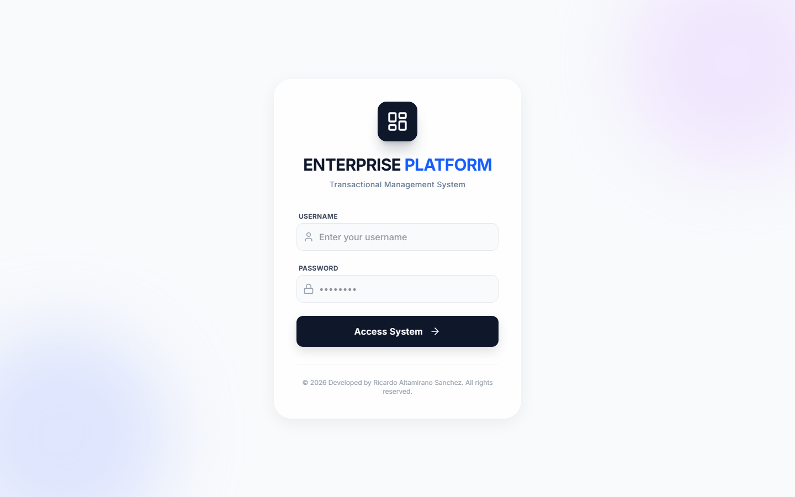
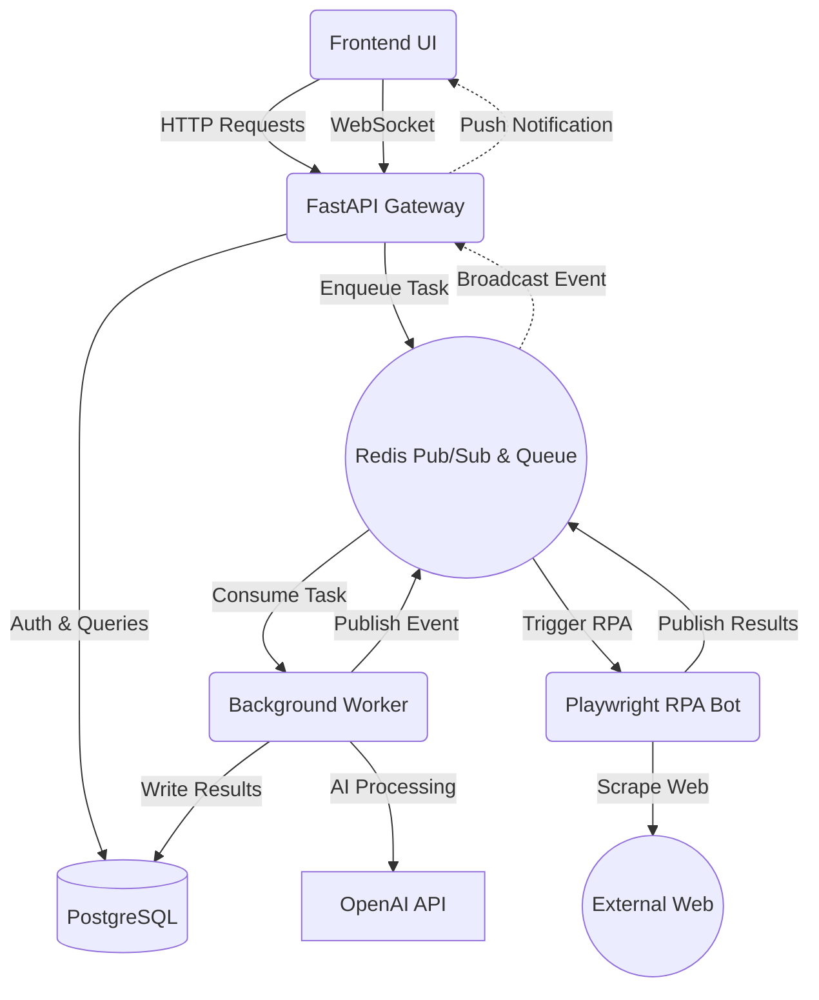
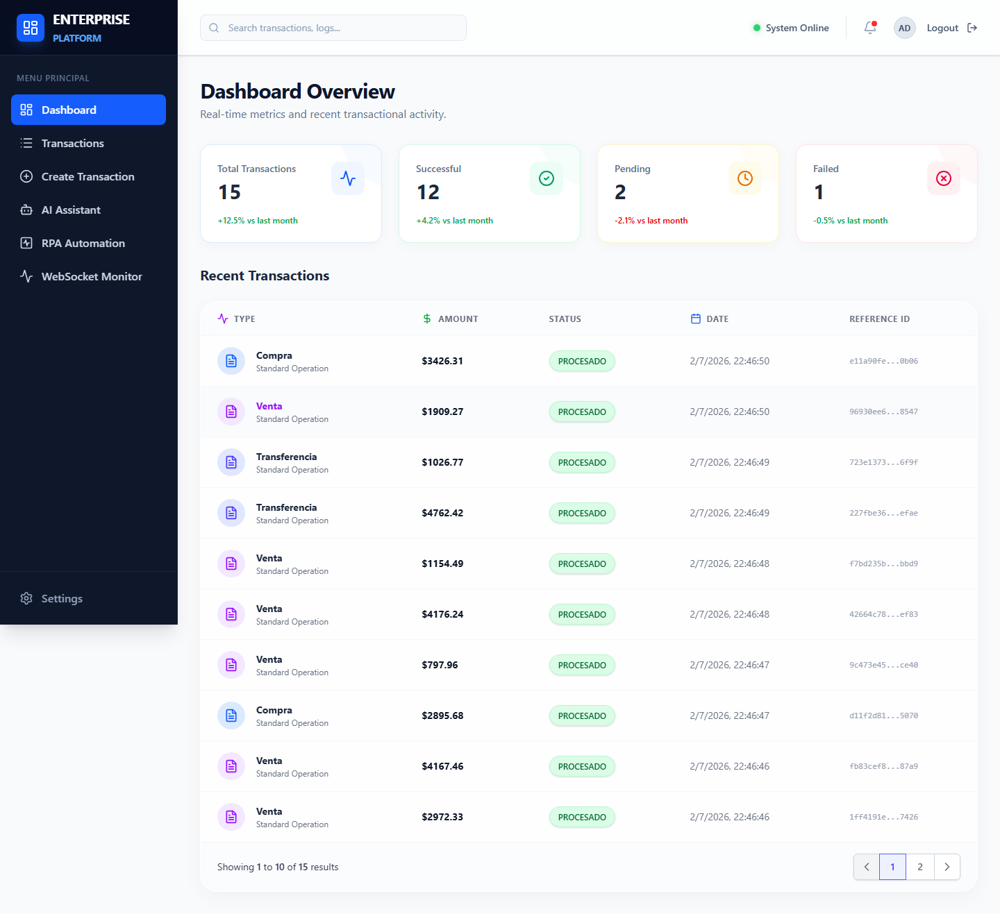
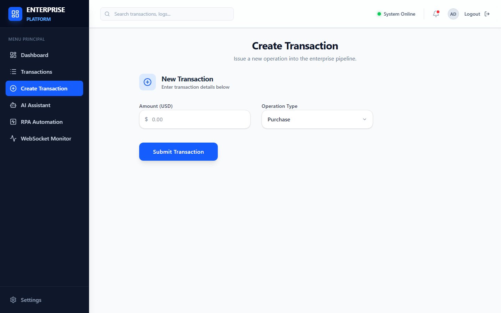
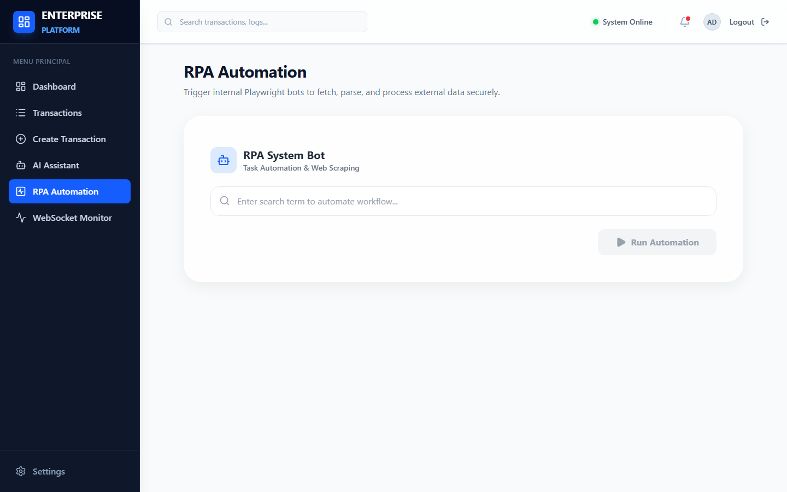
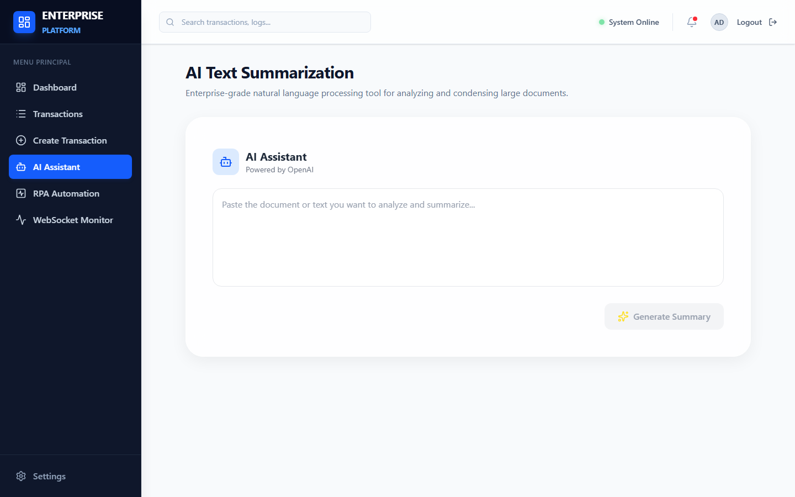
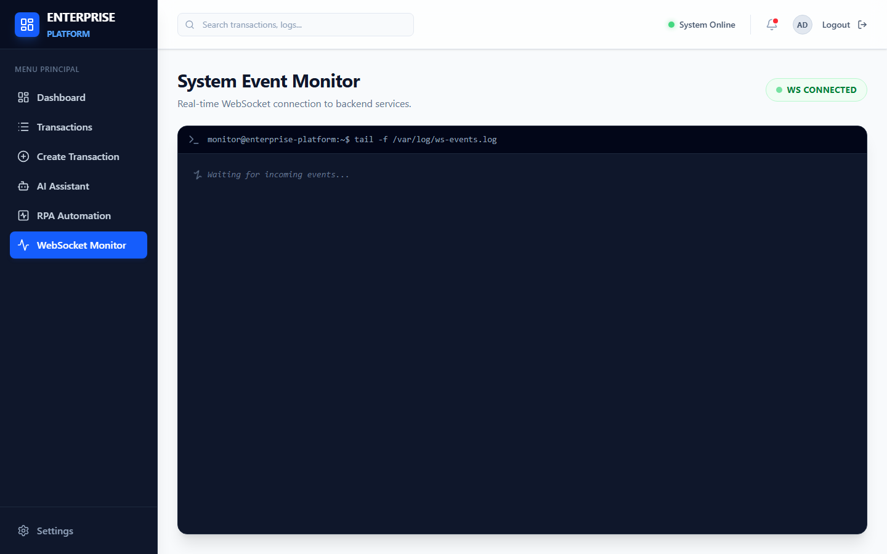

<div align="center">
  

  # Enterprise Event-Driven Platform

  **A scalable, asynchronous full-stack platform integrating RPA, AI, and real-time WebSockets.**

  [](https://www.python.org)
  [](https://fastapi.tiangolo.com)
  [](https://reactjs.org/)
  [](https://www.docker.com/)
  [](https://opensource.org/licenses/MIT)

  <p align="center">
    <a href="#overview">Overview</a> •
    <a href="#architecture">Architecture</a> •
    <a href="#enterprise-features">Features</a> •
    <a href="#screenshots">Screenshots</a> •
    <a href="#quick-start">Quick Start</a> 
  </p>
</div>

---

## Overview

The Enterprise Event-Driven Platform is a production-ready system designed to handle complex business workflows asynchronously. It serves as a centralized hub for executing financial transactions, orchestrating Robotic Process Automation (RPA) bots, and generating AI-powered summaries. Leveraging a Pub/Sub message broker and background workers, it completely decouples heavy processing from the main API lifecycle while keeping clients informed via real-time WebSockets.

---

## Why this project?

Modern web applications often struggle with long-running tasks like web scraping, AI processing, or heavy database operations, which block the main thread and degrade user experience. This project solves that problem by implementing an Event-Driven Architecture (EDA). By utilizing Redis for task queuing and Pub/Sub broadcasting, the system delegates blocking operations to dedicated background workers, ensuring the API remains highly responsive while pushing state updates directly to the frontend instantly.

---

## Enterprise Features

### 🔐 Security
* **JWT Authentication:** Secure access control for all private endpoints.
* **Role-based Authorization:** Granular endpoint protection.
* **Environment Isolation:** Sensitive keys and variables managed securely.

### ⚙️ Backend
* **FastAPI:** High-performance, async RESTful API.
* **Asynchronous Jobs:** Heavy computations offloaded to background Python workers.
* **Task Queues:** Redis-backed processing queues.

### 📡 Real-Time
* **WebSockets:** Live, bi-directional communication channel.
* **Live Dashboard:** Instant UI updates without polling or page reloads.
* **Event Stream:** Terminal-like event monitoring directly in the browser.

### 🤖 Automation
* **AI Integration:** Built-in OpenAI (GPT-3.5/4) connectivity for text summarization.
* **RPA:** Isolated Playwright service for automated data extraction and web scraping.

### 🗄️ Infrastructure
* **Docker Orchestration:** Fully containerized ecosystem (6 microservices).
* **PostgreSQL:** ACID-compliant relational data persistence.
* **Redis:** Dual-purpose message broker and caching layer.
* **Make/Powershell Automation:** Streamlined developer experience for environment teardown and build.

---

## Tech Stack

| Layer | Primary Technologies |
| :--- | :--- |
| **Frontend** | ReactJS, Vite, TailwindCSS, TypeScript, Nginx |
| **Backend API** | Python, FastAPI, SQLAlchemy, Pydantic, JWT |
| **Database** | PostgreSQL |
| **Broker / Cache** | Redis |
| **Automation (RPA)** | Playwright (Python) |
| **AI Integration** | OpenAI API |
| **DevOps** | Docker, Docker Compose, Make |

---

## Architecture



---

## Screenshots

### Real-Time Dashboard


### Operation Management


### RPA Bot Control


### AI Integrations


### System Monitor


---

## Quick Start

### 1. Clone
```bash
git clone git@github.com:RicardoAltamiranoSanchez/enterprise-event-driven-transaction-platform.git
cd enterprise-event-driven-transaction-platform
```

### 2. Environment Variables
```bash
cp .env.example .env
```
*(OpenAI keys are optional; the system will mock AI responses if omitted).*

### 3. Run (Docker)
```bash
docker compose up --build -d
```

### 4. Access
* **Frontend**: `http://localhost:3000` (User: `admin` | Pass: `password123`)
* **Swagger API**: `http://localhost:8000/docs`

---

## Project Structure

```text
enterprise-transaction-platform/
├── backend/            # FastAPI REST API and Core Logic
│   ├── app/            # Routes, Models, Schemas, and Services
│   └── workers/        # Redis consumers and async jobs
├── frontend/           # React SPA (Vite + TailwindCSS)
├── rpa/                # Playwright automation microservice
├── docs/               # Architecture diagrams and assets
├── postman/            # API collection for local testing
├── docker-compose.yml  # Multi-container orchestration
└── Makefile            # Dev environment automation
```

---

## API Overview

The platform exposes a standard REST API documented via OpenAPI 3.0.

* `POST /auth/login` - Authenticate and retrieve JWT token.
* `GET /transactions` - Fetch paginated historical transactions.
* `POST /transactions/async-process` - Enqueue a new transaction for background processing.
* `POST /assistant/summarize` - Enqueue text for AI summarization.
* `POST /rpa/trigger` - Trigger the Playwright bot payload.
* `WS /transactions/stream` - Persistent WebSocket connection for live platform events.

---

## Development

### Environment Management
The project relies strictly on Docker for local development. Make sure your Docker daemon is running.

### Useful Commands
We provide a `Makefile` (Linux/Mac) and `manage.ps1` (Windows) for ease of use.

**Linux / Mac:**
```bash
make build   # Rebuild all containers
make up      # Start the cluster in detached mode
make logs    # Tail all container logs
make down    # Tear down containers and networks
```

**Windows:**
```powershell
.\manage.ps1 build
.\manage.ps1 up
.\manage.ps1 logs
.\manage.ps1 down
```

---

## Roadmap

- [x] JWT Authentication
- [x] Docker Orchestration
- [x] WebSocket Event Streaming
- [x] PostgreSQL Integration
- [x] Redis Pub/Sub & Task Queues
- [x] Playwright RPA Microservice
- [ ] Comprehensive PyTest Suite
- [ ] GraphQL Endpoint Layer
- [ ] Kubernetes (K8s) Deployment Manifests
- [ ] GitHub Actions CI/CD Pipeline
- [ ] OpenTelemetry Tracing

---

## Contributing

Pull requests are welcome. For major changes, please open an issue first to discuss what you would like to change. Ensure all tests pass before submitting.

---

## License

This project is licensed under the MIT License. See the `LICENSE` file for details.