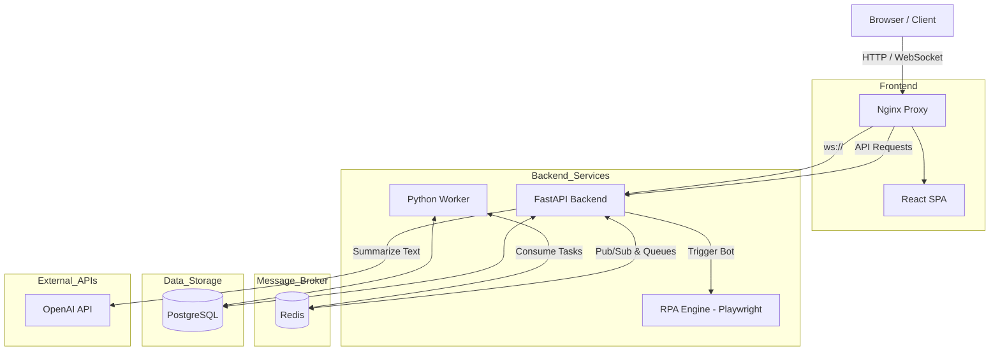

# High-level Architecture

```mermaid
graph TD
    Client[Browser / Client] -->|HTTP / WebSocket| Nginx[Nginx Proxy]
    
    subgraph Frontend
        React[React SPA]
        Nginx --> React
    end
    
    subgraph Backend_Services
        FastAPI[FastAPI Backend]
        Nginx -->|API Requests| FastAPI
        Nginx -->|ws://| FastAPI
        
        RPA[RPA Engine - Playwright]
        FastAPI -->|Trigger Bot| RPA
        
        Worker[Python Worker]
    end
    
    subgraph Message_Broker
        Redis[(Redis)]
        FastAPI <-->|Pub/Sub & Queues| Redis
        Worker <-->|Consume Tasks| Redis
    end
    
    subgraph Data_Storage
        Postgres[(PostgreSQL)]
        FastAPI <--> Postgres
        Worker <--> Postgres
    end
    
    subgraph External_APIs
        OpenAI[OpenAI API]
        FastAPI -->|Summarize Text| OpenAI
    end
```
