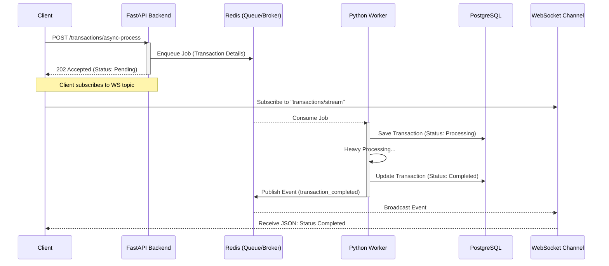

# Transaction Flow Sequence

```mermaid
sequenceDiagram
    participant Client
    participant API as FastAPI Backend
    participant Redis as Redis (Queue/Broker)
    participant Worker as Python Worker
    participant DB as PostgreSQL
    participant WS as WebSocket Channel

    Client->>API: POST /transactions/async-process
    activate API
    API->>Redis: Enqueue Job (Transaction Details)
    API-->>Client: 202 Accepted (Status: Pending)
    deactivate API
    
    note over Client,API: Client subscribes to WS topic
    Client->>WS: Subscribe to "transactions/stream"

    Redis-->>Worker: Consume Job
    activate Worker
    Worker->>DB: Save Transaction (Status: Processing)
    Worker->>Worker: Heavy Processing...
    Worker->>DB: Update Transaction (Status: Completed)
    
    Worker->>Redis: Publish Event (transaction_completed)
    deactivate Worker
    
    Redis-->>WS: Broadcast Event
    WS-->>Client: Receive JSON: Status Completed
```
